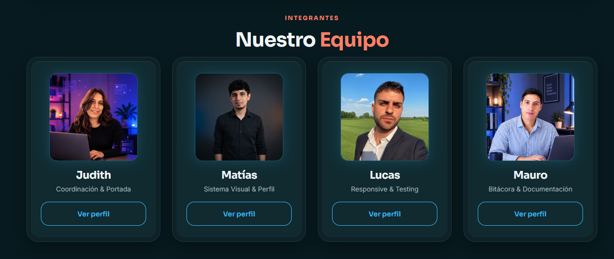
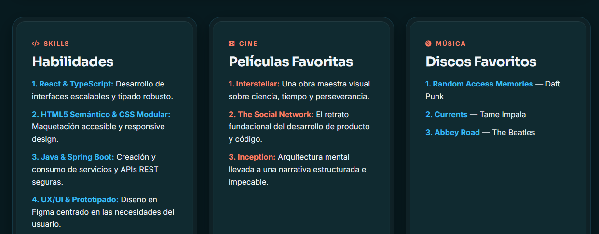
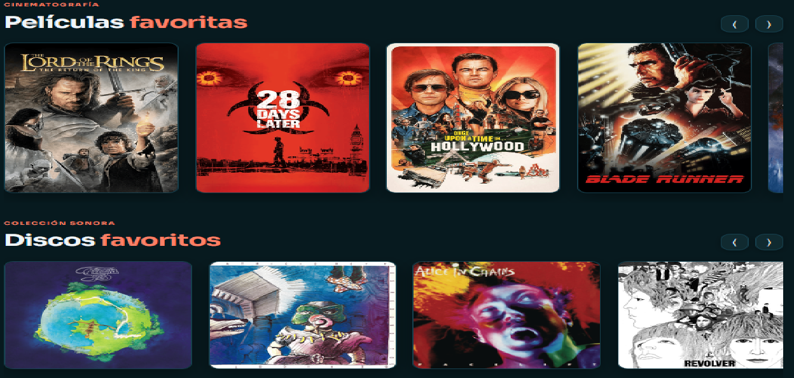
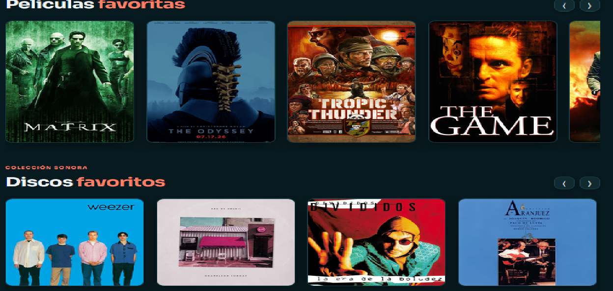
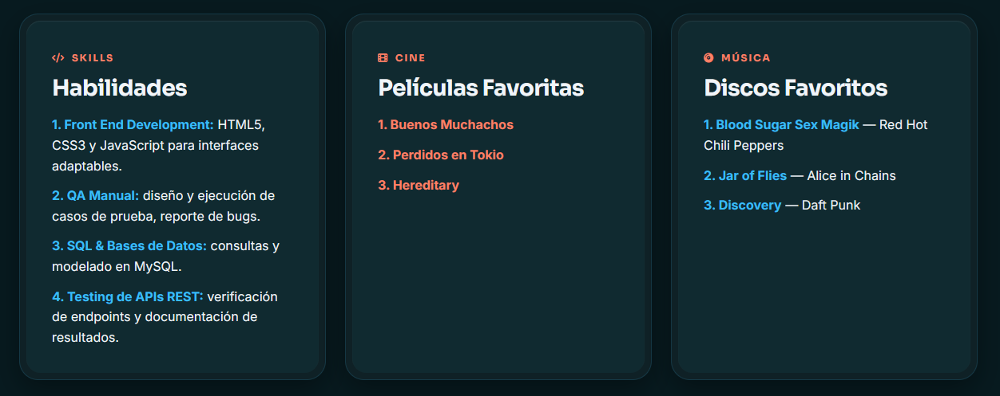
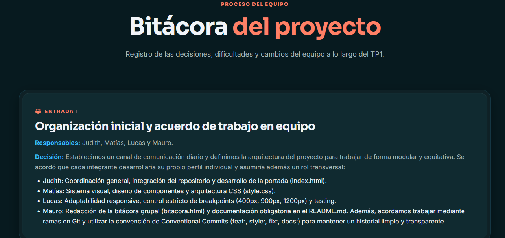

# TP1 — Desarrollo de Sistemas Web Frontend

Sitio web grupal desarrollado para la materia de Desarrollo de Sistemas Web Frontend (Tecnicatura Superior en Desarrollo de Software). El proyecto integra una arquitectura en HTML5 semántico, diseño visual modular con CSS vanilla y dinamismo interactivo con JavaScript puro.

---

## Integrantes del Equipo

- **Judith Grau** — Coordinación & Portada
  - GitHub: [github.com/JudithGrau](https://github.com/JudithGrau)
  - Página: `judith.html`
- **Matías Jara** — Sistema Visual & Perfil
  - GitHub: [github.com/matijara11](https://github.com/matijara11)
  - Página: `matias.html`
- **Lucas Luccaroni** — Responsive Design & Testing
  - GitHub: [github.com/lucasluccaroni](https://github.com/lucasluccaroni)
  - Portafolio: [lucasluccaroni-portfolio.vercel.app](https://lucasluccaroni-portfolio.vercel.app/)
  - Página: `lucas.html`
- **Mauro Flores** — Bitácora & Documentación
  - GitHub: [github.com/floresmauroezequiel1992-beep](https://github.com/floresmauroezequiel1992-beep)
  - Página: `mauro.html`

---

## Tecnologías Utilizadas

- **HTML5**: Maquetación semántica accesible (`header`, `nav`, `main`, `section`, `article`, `footer`).
- **CSS3 Vanilla**: Sistema de tokens de diseño mediante variables personalizadas (`:root`), composición con Flexbox y CSS Grid, estética double-bezel y glassmorphism.
- **JavaScript Vanilla (ES6+)**: Manipulación del DOM, scroll programático y generación dinámica de contenidos.
- **Google Fonts**: Familias tipográficas *Sora* (títulos) e *Inter* (cuerpo de texto).
- **FontAwesome 6.7.2**: Iconografía vectorial para perfiles y metadatos.

---

## Guía de Estilos

### Paleta de Colores (Tokens Hexadecimales)
- Fondo Principal (`--color-bg`): `#071A1F`
- Superficie de Tarjetas (`--color-surface`): `#102A30`
- Superficie Interactiva (`--color-surface-hover`): `#163840`
- Acento Primario Azul (`--color-blue`): `#38BDF8`
- Acento Coral / Enlace (`--color-coral`): `#FF8066`
- Texto Principal (`--color-text`): `#F1F5F9`
- Texto Secundario (`--color-text-secondary`): `#A7B8BA`
- Bordes Sutiles (`--color-border`): `rgba(56, 189, 248, 0.15)`

### Tipografía
- Títulos y Encabezados: `Sora`, sans-serif (pesos 600, 700, 800).
- Texto General y Párrafos: `Inter`, sans-serif (pesos 300, 400, 500, 600).

### Iconografía
- **FontAwesome 6.7.2** (vía CDN), usado en íconos de perfiles (ubicación, cumpleaños, redes), etiquetas temáticas (`eyebrow`) y elementos de navegación.
- Emojis puntuales (✦, ↗, ↑) como refuerzo visual en botones e interacciones dinámicas.

---

## Estructura de Archivos y Carpetas

```
tp1-desarrollo-sistemas-web-frontend/
├── index.html              # Portada principal y presentacion del equipo
├── judith.html             # Perfil individual de Judith Grau
├── matias.html             # Perfil individual de Matias Jara
├── lucas.html              # Perfil individual de Lucas Luccaroni
├── mauro.html              # Perfil individual de Mauro Flores
├── bitacora.html           # Registro cronologico de decisiones y dificultades
│
├── css/
│   └── style.css           # Hoja de estilos compartida, variables y diseno responsive
│
├── js/
│   └── script.js           # Logica interactiva global y de perfiles individuales
│
├── img/                    # Activos gráficos y fotografías del equipo
│   ├── judith.png
│   ├── matias.png
│   ├── lucas.png
│   ├── mauro.png
│   ├── favicon.svg
│   ├── screenshots/        # Capturas de pantalla usadas en este README
│   │   ├── Bitacora.png
│   │   ├── Perfil Judith.png
│   │   ├── Perfil Lucas.png
│   │   ├── Perfil Mati.png
│   │   ├── Perfil Mauro.png
│   │   └── Portada.png
│         
│   └── other/
│       ├── perfil-mati/    # Imágenes de discos y películas de Matías
│       └── perfil-lucas/   # Imágenes de discos y películas de Lucas
│
└── README.md               # Documentación técnica del proyecto
```

---

## Funciones Dinámicas en JavaScript

### 1. Portada (`index.html`) — Selector Aleatorio de Integrantes
Permite seleccionar al azar un integrante del equipo al presionar el botón de dinámica grupal, renderizando en pantalla una tarjeta destacada con avatar, rol, descripción y enlace directo al perfil correspondiente sin recargar la página.

### 2. Perfil de Judith (`judith.html`) — Generador de Recomendaciones
Genera de manera aleatoria consejos técnicos y combinaciones de películas o discos para sesiones de programación mediante un array dinámico en JavaScript.

### 3. Perfil de Matías (`matias.html`) — Carruseles de Scroll Horizontal
Permite el desplazamiento interactivo horizontal bidireccional mediante botones prev/next sobre las colecciones de cine y música, complementado con tarjetas con efecto hover y zoom.

### 4. Perfil de Lucas (`lucas.html`) — Carruseles Multimedia de Cine y Música
Desplazamiento horizontal interactivo bidireccional mediante botones prev/next sobre su colección de 6 películas y 5 discos musicales, complementado con tarjetas con efecto hover, zoom animado y ficha descriptiva en overlay.

### 5. Perfil de Mauro (`mauro.html`) — Revelador de Información Adicional
Expande y alterna datos biográficos y de certificaciones complementarias de forma dinámica al hacer clic en el botón interactivo.

---

## Capturas de pantalla








---

## Diseño Adaptativo (Responsive Design)

El proyecto cuenta con una arquitectura adaptable en `css/style.css` que responde a los tres breakpoints obligatorios de la consigna:

1. **Desktop / Base (1200px)**:
   - Límite de contenedor centrado en 1200px con márgenes laterales de protección.
   - Grilla del equipo (`.team-grid`) distribuida en 4 columnas equilibradas.
   - Posicionamiento seguro de botones de navegación en carruseles sin desborde de ventana.

2. **Tablet / Pantallas Medianas (900px)**:
   - Reorganización de la grilla de integrantes a 2 columnas.
   - Barra de navegación en flujo vertical alineado.
   - Adaptación de componentes hero y tarjetas `double-bezel` para visualización legible en orientación vertical.

3. **Mobile (400px)**:
   - Grilla de tarjetas colapsada a 1 columna (ancho del 100%).
   - Barra de navegación compacta con wrap de enlaces para prevenir desbordes horizontales (`overflow-x: hidden`).
   - Escala tipográfica fluida mediante funciones `clamp()`.
   - Dimensionamiento táctil accesible en botones y enlaces interactivos (mínimo 44px de altura según recomendaciones WCAG).

---

## Demo

🔗 Sitio publicado: [tp1-desarrollo-sistemas-web-fronten.vercel.app](https://tp1-desarrollo-sistemas-web-fronten.vercel.app/)

---

## Evolución del Proyecto

Este TP1 sentó la base técnica del equipo: estructura de repositorio compartido, sistema de diseño propio (double-bezel, tokens de color, tipografía Sora/Inter) y una dinámica de trabajo colaborativo con commits individuales. De cara a los próximos trabajos prácticos, el equipo planea:

- Profundizar la modularización del CSS (separar variables, componentes y utilidades en archivos distintos).
- Sumar más interacciones dinámicas y, eventualmente, consumo de datos desde una API externa.
- Mejorar la cobertura de testing manual en distintos navegadores y dispositivos reales.
- Revisar accesibilidad (contraste, navegación por teclado, atributos ARIA) en mayor profundidad.

---

## Uso de Inteligencia Artificial y Criterio de Privacidad

En cumplimiento con la sección didáctica y transversal del trabajo práctico:

- **Herramientas y Modelos Utilizados**: Se emplearon asistentes de código (Antigravity) y Claude (Anthropic) para soporte en la sección de Mauro (perfil, bitácora y base del README).
- **Plan utilizado**: Plan gratuito en todos los casos.
- **Experiencia Previa del Equipo**: Nivel intermedio en desarrollo web y uso de IA generativa orientada a consultas sintácticas, arquitectura de maquetación y aceleración de flujos de trabajo.
- **Alcance de la Asistencia**: Asistencia en la modularización de estilos CSS, estructuración semántica de `lucas.html`, arquitectura de media queries adaptativas y documentación técnica. En el caso de Mauro, en la redacción de `mauro.html`, `bitacora.html` y este `README.md`.
- **Criterio de Privacidad y Seguridad**: No se incorporaron credenciales reales ni claves privadas en el repositorio. Se mantuvieron las directivas de seguridad locales y el seguimiento incremental en `docs/estado_actual.md` protegido en `.gitignore`.
- **Criterio Propio y Adaptación**: Cada bloque de código sugerido fue revisado, adaptado a la arquitectura de diseño preexistente definida por el equipo (`double-bezel`, paleta de tokens `:root`, convenciones de nombres) y validado manualmente para asegurar total armonía visual y estructural.

---